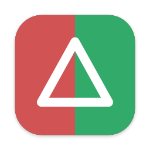

<p align="center">
  
</p>

<h1 align="center">Delta — Diff Viewer</h1>

<p align="center">A small, native macOS app for comparing two texts. Built for Markdown first.</p>

---

Paste the original text on the left and the changed version on the right. Delta shows what changed as you type:

- **Raw view**: a line-by-line diff, side by side or inline, with the exact words that changed highlighted.
- **Rendered view**: both texts rendered as Markdown, with insertions in green, deletions in red and struck through, and a marker next to every changed block.

Other features:
- **Navigate changes:** jump between changes with ⌥⌘↓ and ⌥⌘↑.
- **Ignore whitespace:** an option for the raw view.
- **Swap sides** with one click.
- **Counts:** lines, words and characters for each side.
- **Counts:** lines, words and characters for each side.
- **Text is kept:** whatever you pasted is still there the next time you open the app.

## Install

1. Download the latest **Delta-x.y.z.dmg** from [Releases](../../releases/latest).
2. Open it and drag **Delta** into **Applications**.
3. The first time only, macOS will say Delta "could not be verified", because the app isn't notarized by Apple. To allow it:
   - Click **Done** on that dialog.
   - Open **System Settings → Privacy & Security**.
   - Scroll down to the message about Delta and click **Open Anyway**.
   - Confirm with your password or Touch ID.

   After that, Delta opens normally.

Requires macOS 14 Sonoma or later.

## Keyboard shortcuts

| Action | Shortcut |
|---|---|
| Raw / Rendered view | ⌘1 / ⌘2 |
| Next / previous change | ⌥⌘↓ / ⌥⌘↑ |
| Compare now | ⌘↩ |
| Show / hide inputs | ⇧⌘I |
| Swap sides | ⇧⌘S |
| Clear both | ⇧⌘⌫ |

## Development

Requires Xcode 16 or later and [XcodeGen](https://github.com/yonaskolb/XcodeGen) (`brew install xcodegen`). The Xcode project is generated from `project.yml` and isn't checked in.

```bash
make test      # run unit tests
make run       # build and launch
make install   # build and copy to /Applications (no Gatekeeper prompt for local builds)
make dmg       # build dist/Delta-<version>.dmg
make release VERSION=x.y.z  # tag and publish a release
```

To publish a release, run the command below. It bumps the version, runs the tests, then tags and pushes. GitHub Actions builds the `.dmg` and attaches it to a GitHub Release. See [AGENTS.md](AGENTS.md#releasing-a-new-version) for details.

```bash
make release VERSION=0.2.0
```

### How it works

- `Sources/Model/DiffEngine.swift` runs a line diff (Myers, via Swift's `CollectionDifference`). It then pairs up changed lines and runs a word-level diff on each pair.
- `Sources/Rendering/RenderedDiff.swift` renders both texts to HTML with [swift-markdown](https://github.com/swiftlang/swift-markdown). It then diffs the HTML token streams, wrapping changed text in `<ins>` and `<del>`. Scripts in pasted content are blocked by a Content Security Policy.
